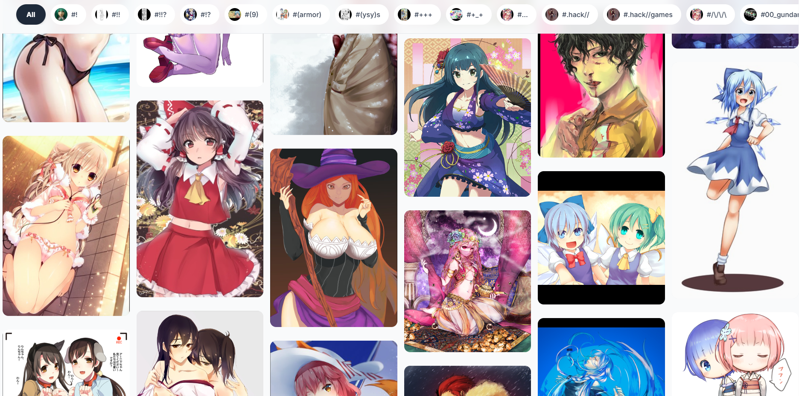
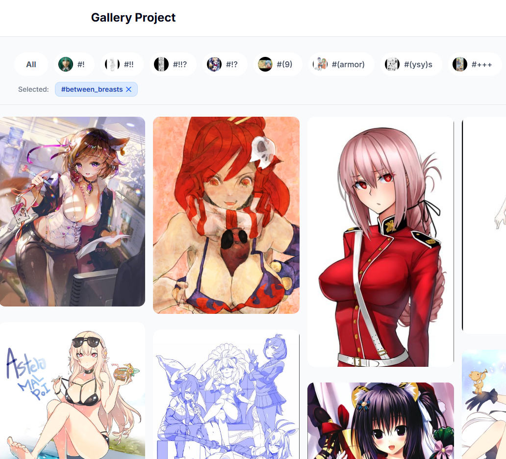
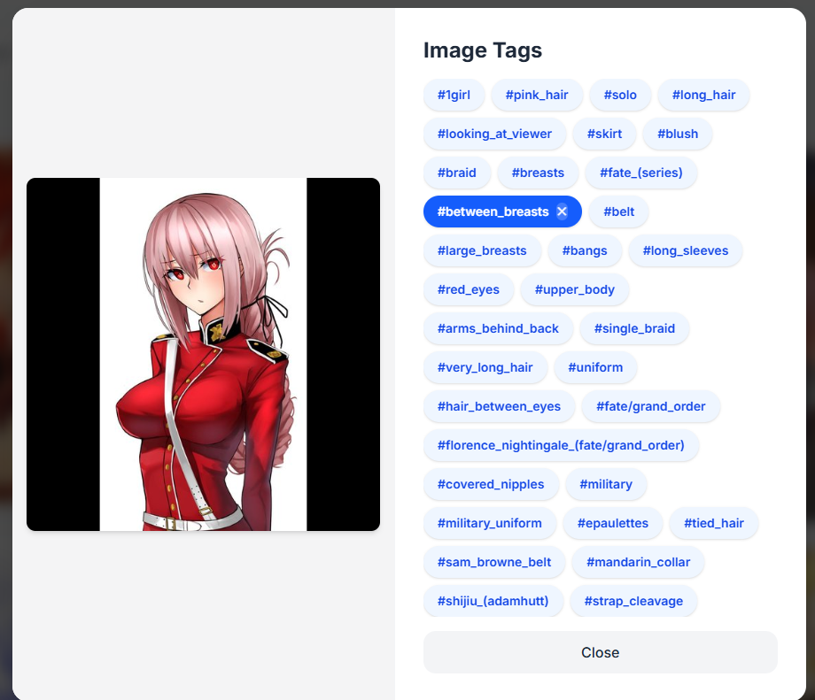
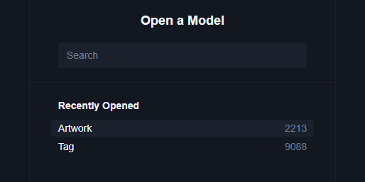
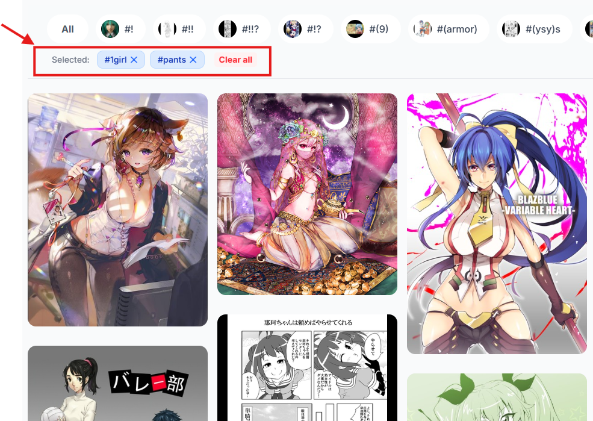
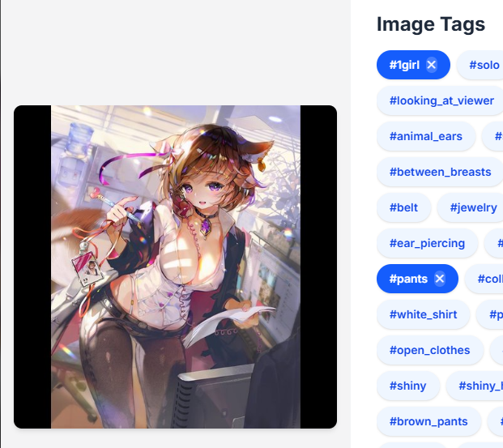

<div align="center">
  
  
  <h1>Gallery Project</h1>

  <p>
    <a href="https://gallery-project-gules.vercel.app/">
      
    </a>
    
  </p>
</div>

## สารบัญ (Table of Contents)

- [คุณสมบัติที่ต้องการออกแบบ](#คุณสมบัติที่ต้องการออกแบบ)
  1. [หน้าเว็บเพจแสดง Gallery รูปภาพพร้อม hashtag คำสำคัญของแต่ละรูป](#ข้อกำหนดที่1)

  2. [แสดงทีละไม่เกิน x รูป (กำหนดเองตามความเหมาะสม) และเมื่อ scroll ลงด้านล่างจึงโหลดแสดงเพิ่มอัตโนมัติ](#ข้อกำหนดที่2)

  3. [แต่ละรูปภาพมีขนาดไม่เท่ากัน และสามารถมีคำสำคัญได้ไม่จำกัดจำนวน](#ข้อกำหนดที่3)

  4. [เมื่อกดที่คำสำคัญ รายการรูปที่แสดงในหน้าเว็บเพจจะถูกกรองให้เหลือแสดงเฉพาะรูปภาพที่มีคำ สำคัญที่ถูกกดเลือกอยู่นั้น](#ข้อกำหนดที่4)

  5. [สามารถใช้รูปเป็น placeholder จาก placehold.co และ generate คำสำคัญสำหรับแสดง ตัวอย่างเองได้โดยไม่จำเป็นต้องมีความหมายความสัมพันธ์กับรูป แต่ให้คำนึงถึงการทดลองใช้งานและ การตรวจแบบทดสอบว่าสามารถทำได้สะดวก ](#ข้อกำหนดที่5)

  6. [ระบุ Architecture และเทคโนโลยีที่จะใช้บน Production ทั้งหมด ตั้งแต่ Server specifications, OS/software ไปจนถึงวิธีการ deploy โดยสามารถทำเป็น diagram ประกอบการอธิบายได้](#ข้อกำหนดที่6)

- [Author](#author)

## คุณสมบัติที่ต้องการออกแบบ

### ข้อกำหนดที่1

หน้าเว็บเพจแสดง Gallery รูปภาพพร้อม hashtag คำสำคัญของแต่ละรูป

<div align="center">
  <table border="0">
    <tr>
      <td align="center"><b>ก่อนคลิกรูป</b></td>
      <td align="center"><b>ก่อนคลิกรูป</b></td>
    </tr>
    <tr>
      <td></td>
      <td></td>
    </tr>
  </table>
</div>

### ข้อกำหนดที่2

แสดงทีละไม่เกิน x รูป (กำหนดเองตามความเหมาะสม) และเมื่อ scroll ลงด้านล่างจึงโหลดแสดงเพิ่มอัตโนมัติ

**Logic การคำนวณหน้าจอ:**

- **Mobile (< 1300px):** แสดง 12 รูป
- **Standard (1300px - 1600px):** แสดง 50 รูป
- **Large Desktop (> 1600px):** แสดง 60 รูป

```typescript
// File: (root)/page.ts
const getInitialLimit = useCallback(() => {
  if (typeof window === "undefined") return 12;
  const width = window.innerWidth;
  if (width >= 1600) return 60;
  if (width >= 1300) return 50;
  return 12;
}, []);
```

### ข้อกำหนดที่3

แต่ละรูปภาพมีขนาดไม่เท่ากัน และสามารถมีคำสำคัญได้ไม่จำกัดจำนวน

ดูจากรูปใน [ข้อกำหนดที่1](#ข้อกำหนดที่1)

> [!NOTE]
> **Database Statistics:** ปัจจุบันระบบรองรับ Tag ทั้งหมด **9,088** รายการ และรูปภาพทั้งหมด **2,213** รูปในฐานข้อมูล

<p align="center">
  
</p>

### ข้อกำหนดที่4

เมื่อกดที่คำสำคัญ รายการรูปที่แสดงในหน้าเว็บเพจจะถูกกรองให้เหลือแสดงเฉพาะรูปภาพที่มีคำ สำคัญที่ถูกกดเลือกอยู่นั้น

<div align="center">
  <table border="0">
    <tr>
      <td align="center"><b> Homepage</b></td>
      <td align="center"><b> Image Modal</b></td>
    </tr>
    <tr>
      <td></td>
      <td></td>
    </tr>
  </table>
</div>

### ข้อกำหนดที่5

สามารถใช้รูปเป็น placeholder จาก placehold.co และ generate คำสำคัญสำหรับแสดง ตัวอย่างเองได้โดยไม่จำเป็นต้องมีความหมายความสัมพันธ์กับรูป แต่ให้คำนึงถึงการทดลองใช้งานและ การตรวจแบบทดสอบว่าสามารถทำได้สะดวก

- **Dataset:** ข้อมูลรูปภาพและ Tag มีความสัมพันธ์กันโดยอ้างอิงจาก [Kaggle: Tagged Anime Illustrations](https://www.kaggle.com/datasets/mylesoneill/tagged-anime-illustrations)

## ข้อกำหนดที่6

ระบุ Architecture และเทคโนโลยีที่จะใช้บน Production ทั้งหมด ตั้งแต่ Server specifications, OS/software ไปจนถึงวิธีการ deploy โดยสามารถทำเป็น diagram ประกอบการอธิบายได้

โปรเจกต์นี้เลือกใช้ **Serverless Ecosystem** เพื่อประสิทธิภาพในการ Scale และลดภาระการดูแลรักษา (Maintainability)

#### Frontend & Compute (Next.js + Vercel)

- ใช้ **Next.js** บน **Vercel** เพื่อใช้ประโยชน์จาก Edge Runtime และ Serverless Functions
- **Auto-scaling:** ปรับทรัพยากรตาม Traffic จริงอัตโนมัติ
- **Region:** Deploy ที่ `Singapore (sin1)` เพื่อความรวดเร็วสำหรับผู้ใช้ในไทย

#### Data Layer (Neon + Prisma + Postgres)

- **Neon DB:** Serverless Postgres ที่รองรับ Database Branching แยกสภาพแวดล้อม Dev/Prod ได้อย่างอิสระ
- **Prisma ORM:** ช่วยจัดการ Type-safe schema และทำ Migration ได้แม่นยำผ่าน Code

#### Storage (Vercel Blob)

- ใช้เก็บรูปภาพ Gallery ทั้งหมดแทนการเก็บใน Server เพื่อความทนทาน (**Durability**) สูง และเรียกใช้งานผ่าน Edge Network ได้รวดเร็ว

#### OS & Environment

- รันบน **Node.js** บน **Managed Linux** ของ Vercel มั่นใจได้เรื่อง Security Patching โดย Cloud Provider

#### Deployment & CI/CD

- ใช้ **Git-based Workflow** โดยเมื่อ Merge เข้า `main` branch ระบบจะรัน `prisma generate` และ `prisma migrate deploy` อัตโนมัติ เพื่อให้ DB Schema ตรงกับ Code ล่าสุดเสมอ

## Author

- **GitHub:** [@nnnn000](https://github.com/nnnn000)
- **Email:** Narongton_000@hotmail.com
